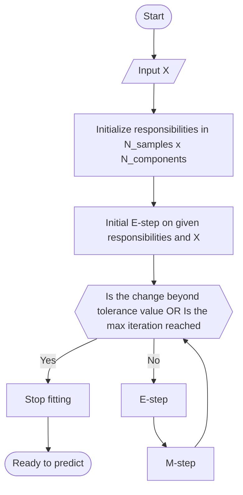

# Gaussian Mixture
Gaussian Mixture from scratch in Python using EM algorithm    

1. Randomly assign responsibility values to each item
2. Compute Gaussian params like means and etc
3. E step, using previous 'weights', 'means' and 'covs' to evalute 'responsibility'
4. M step, using 'responsibility' to evaluate 'weights', 'means', 'covs'
5. Loop while beyond threshold

# References
- [EM algorithm: how it works](https://www.youtube.com/watch?v=REypj2sy_5U)
